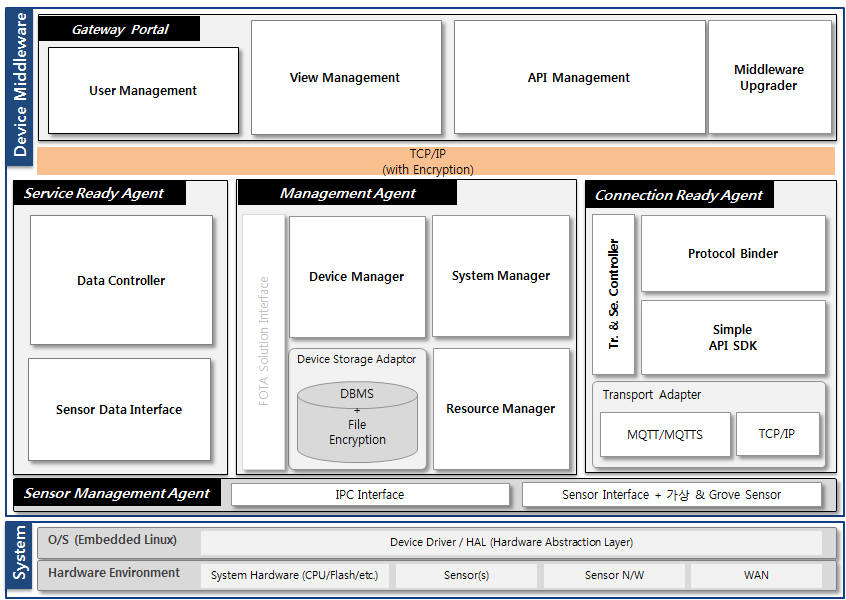

# ThingPlug 2.0 Device Middleware

## ThingPlug 2.0을 위한 Device 미들웨어 설치 및 실행가이드
본 챕터는 SKT ThingPlug Device 미들웨어 설치 및 실행 방법을 서술한다.

#### 1. ThingPlug Device 미들웨어 란?
개방형 사물인터넷 플랫폼 ThingPlug 2.0을 위한 Device 미들웨어는 ThingPlug 와의 연동을 쉽게 해주고 다양한 Device 에 적용 가능한, Device 개발자 및 서비스 개발자를 위한 소프트웨어이다.

* 미들웨어는 총 2개의 모듈과 5개의 에이전트로 구성되어 있으며, 각각의 에이전트를 통해 사물과 ThingPlug 간 연동을 수행한다.
* **Management Agent** 는 미들웨어 내부의 모든 명령 및 처리의 중심에서 실제적인 역할을 수행한다. User 와의 외부 Interface 는 Gateway Portal, ThingPlug 와는 Connection Ready Agent 와 연동하며, 내부 Device/Sensor 와는 Service Ready Agent 를 통해 연동한다.
* **Connection Ready Agent** 는 Simple Protocol 을 지원하며, ThingPlug 서버와 통신을 담당한다. 통신은 MQTT(S) 방식을 사용한다.
* **Service Ready Agent** 는 Sensor Management Agent 로 부터 전달받은 센서 관련 정보들을, 센서별 정책에 따라서 데이터를 가공하는 역할을 한다. 가공된 센서 정보는 Management Agent 로 전달한다.
* **Sensor Management Agent** 는 센서 데이터를 수집하고, 직접 제어를 담당하며, Management Agent 와 데이터를 주고 받는다.
* **Gateway Portal** 은 관리자/개발자가 미들웨어 시스템을 제어하고, 각종 정보를 조회할 수 있는 사용자 인터페이스이며, Node.js 기반의 어플리케이션으로 구현되어 있다.

#### 2. ThingPlug 와의 연동 구조
ThingPlug 와의 Protocol 은 SimpleAPI를 지원한다.


#### 3. 지원 사양 및 하드웨어
* 권장 사양
  * Memory : 128 Mb 이상
  * CPU : 200MHz 이상
* 테스트 환경
  * Raspberry Pi2/3, BeagleBone Black 외 ARM/Linux 디바이스

#### 4. 환경 설정

0. 윈도우 사용자의 경우 아래의 URL 에서 putty 를 다운받아 설치한다.
	* http://www.chiark.greenend.org.uk/~sgtatham/putty/download.html
1. 인터넷 연결을 위하여 Ethernet(LAN 케이블)이나 Wi-Fi USB 동글을 장치에 연결한다.
2. 터미널(윈도우 PC에서는 putty)을 열고 각 장치 환경에 따라 네트워크 환경을 설정한다.
3. 처음 실행하는 장치를 업데이트 및 업그레이드 한다.

	```
	# apt-get update
	# apt-get upgrade
	```

#### 5. 미들웨어에서 사용하는 Library 안내
미들웨어에서 사용하는 Library 들은 다음과 같다.
<table>
<thead><tr><th>Part</th><th>Library</th><th>Type</th><th>용도</th></tr></thead>
<tbody>
<tr><td rowspan="7">Gateway Portal</td><td>express</td><td>패키지 포함</td><td>프레임워크</td></tr>
<tr><td>express-session</td><td>패키지 포함</td><td>Express 에 Session 추가</td></tr>
<tr><td>body-parser</td><td>패키지 포함</td><td>Express 에 BodyParser 추가</td></tr>
<tr><td>request</td><td>패키지 포함</td><td>http request 전송</td></tr>
<tr><td>xml2js</td><td>패키지 포함</td><td>XML 파싱</td></tr>
<tr><td>ping</td><td>패키지 포함</td><td>Ping 체크</td></tr>
<tr><td>i18n</td><td>패키지 포함</td><td>다국어 지원</td></tr>
<tr><td rowspan="4">Management Agent</td><td>libcurl</td><td>패키지 포함</td><td>미들웨어 업그레이드</td></tr>
<tr><td>libpaho-mqtt3as</td><td>패키지 포함</td><td>MQTT TLS 통신</td></tr>
<tr><td>libsqlite3</td><td>shared</td><td>데이터 저장</td></tr>
</tbody>
</table>

#### 6. 패키지 설치
0. 데비안 패키지 파일을 다운로드 한다.

	```
	# wget https://github.com/SKT-ThingPlug2/device-middleware/raw/master/pkg/thingplug_dmw_ARM_2.0.1_1803061640.deb
	```

1. 데비안 패키지를 설치한다.(반드시 root 계정을 이용해야 한다.)	

	* 일반적으로 dpkg 명령을 통하여 패키지를 설치한다.
	```
	# dpkg -i thingplug_dmw_ARM_2.0.0_1712221030.deb
	```
	* Library dependencies 등의 문제가 발생할 경우 gdebi 를 이용하여 패키지를 설치한다.
	```
	# apt-get install gdebi
	# gdebi thingplug_dmw_ARM_2.0.0_1712221030.deb
	```

#### 7. 패키지 설치 확인
* 브라우저에서 http://IP-address:8000 번으로 접속하여 다음과 같은 화면(Gateway Portal)이 나오면 모든 설치가 완료된 것이다.  

> 로그인 화면에서 아이디 / 비밀번호 : thingplugadmin / [mac-address(:제외)]

* 최초 로그인시에 계정 등록이 필요하다.

> 안내에따라 원하는 아이디와 비밀번호를 적용한다.

* 계정을 등록하면 대시보드를 확인할 수 있다.

> 센서 위젯은 연결조회 > 센서 메뉴에서 센서와 드라이버 연결후에 가능하다.

* 관리자 계정 비밀번호 변경하기

> 환경설정 > 관리자설정 메뉴에서 계정 비밀번호를 변경할 수 있다.

#### 8. 사용 방법
0. 정지

	```
	# service middleware stop
	```

1. 시작

	```
	# service middleware star
	```

2. 재시작

	```
	# service middleware restart
	```

3. 구동 확인

	```
	# ps xl | grep middleware
	```

4. 제거
	* 제거 후 usr/local/middleware 내부의 resource_v2.db 파일, log 폴더가 남겨지며, conf 폴더의 파일들은 /tmp/middleware_backup_v2_00 폴더로 복사되어 남겨진다.

	```
	# dpkg -r devicemiddleware
	```

#### 9. 기기 등록
* [ThingPlug Device 미들웨어 기기 등록 가이드](Simple_Guide.md)

#### 10. 센서
* [센서 연동 가이드](SMA_Guide.md)
* [BeagleBone Black 장치의 센서 드라이버 설치 가이드](BBB_Sensor_Installation.md)

