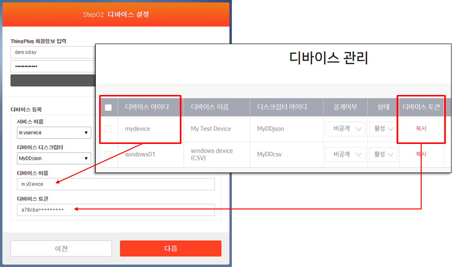
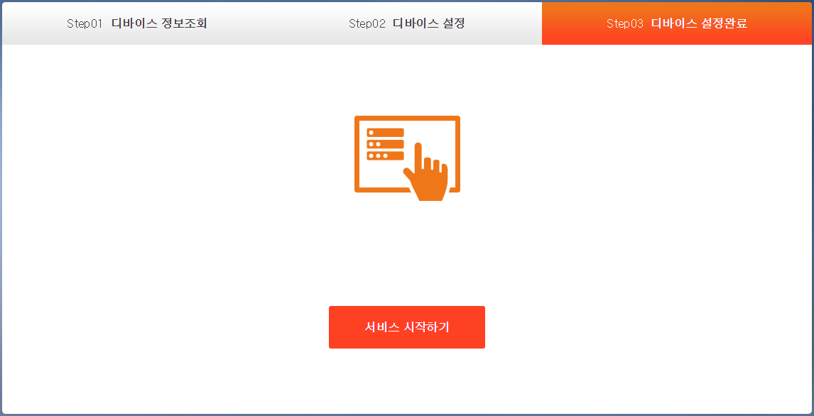
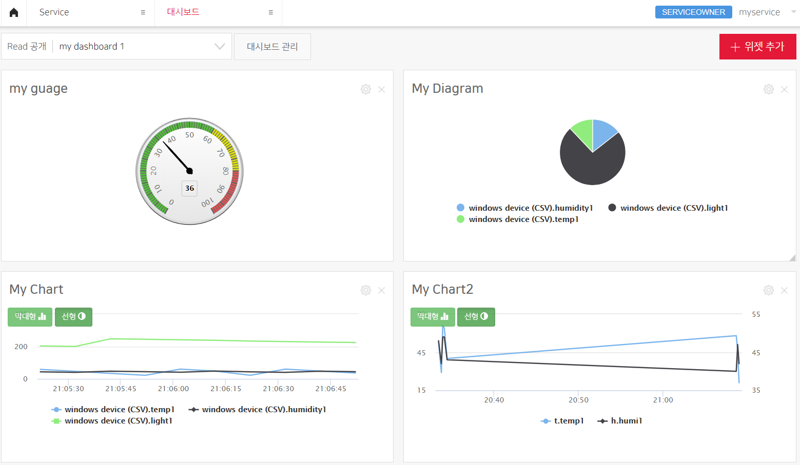

## ThingPlug Device 미들웨어 등록 가이드
다음 안내에 따라서 기기를 등록한다.

#### Gateway Portal 간편 세팅
* 브라우저에서 http://IP-address:8000 번으로 접속하여 `간편세팅 > 로그인` 하여 **Step01 디바이스 정보조회** 화면으로 이동한다.
* ThingPlug 회원가입이 필요한 경우 회원가입 버튼을 통하여 가입을 진행한다.
* 다음 버튼을 클릭한다.

#### 기기 등록
*  **Step02 디바이스 설정** 화면에서 기기를 등록한다.
*  먼저 로그인을 진행해야 서비스이름과 디바이스 디스크립터를 선택할 수 있다.
*  서비스 이름을 선택한다.
*  디바이스 디스크립터를 선택한다.
*  등록할 디바이스 이름과 토큰은 ThingPlug Portal 에 등록한 정보로 설정한다.

#### 기기 등록 완료
* 등록이 정상적으로 완료되면 **Step03 디바이스 설정완료** 로 이동된다.
* 서비스 시작하기를 클릭한다.

* 등록이 성공한 기기는 ThingPlug Portal `Service > 대시보드` 메뉴에서 위젯을 추가하면 아래와 같이 확인이 가능하다.

